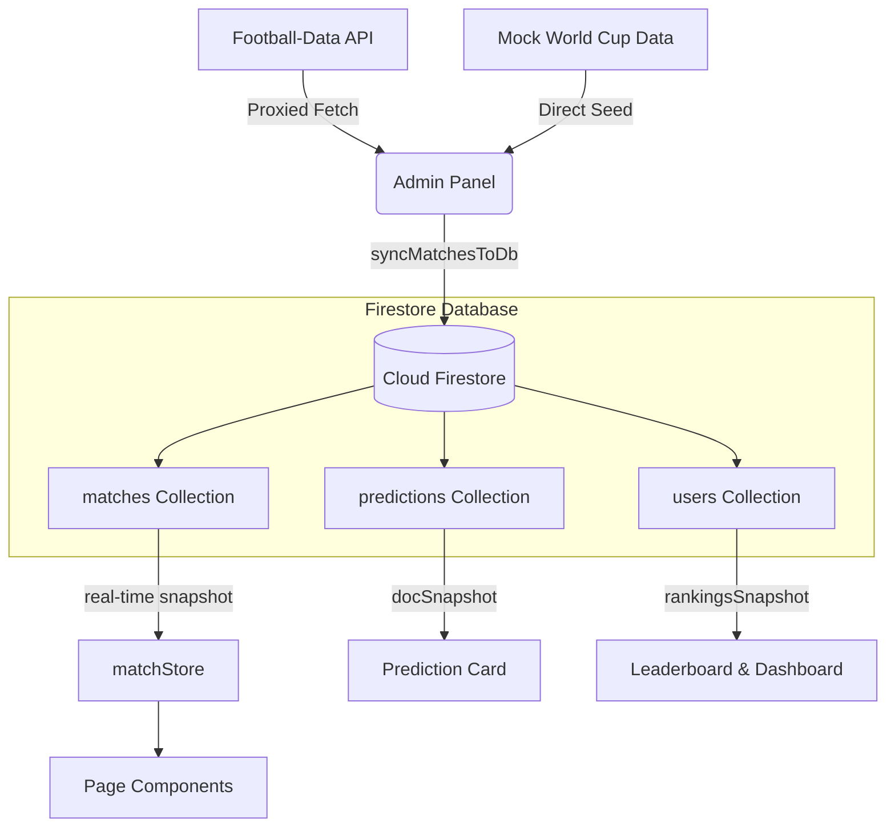

# World Cup 2026 Prediction Web Application - Developer Guide

Welcome to the **World Cup 2026 Match Predictor & Leaderboard** codebase documentation. This document serves as a comprehensive developer reference, mapping out the project structure, build configurations, real-time data flows, and the technical integrations implemented to establish a robust local and production state.

---

## 🗺️ Project Architecture & File Structure

This is a modern client-side Single Page Application (SPA) built using **Svelte 5 (Runes Mode)** and **Vite** as the bundler. 

Here is the directory tree and what each component is responsible for:

```
PredictWorldCup2026/
├── src/
│   ├── lib/                  # Core modules, utilities, and database managers
│   │   ├── api.js            # External football-data.org API integrations
│   │   ├── db.js             # Cloud Firestore read/write operations and subscribers
│   │   ├── firebase.js       # Firebase initialization & configuration credentials
│   │   ├── mockData.js       # Pre-seeded World Cup 2026 match database
│   │   ├── scoring.js        # Prediction points & correctness calculations
│   │   └── stores.svelte.js  # Reactive global state stores (Svelte 5 Runes)
│   │
│   ├── components/           # Reusable UI component templates
│   │   ├── ErrorMessage.svelte   # Premium connection error & Firestore setup guides
│   │   ├── Navbar.svelte         # Primary glassmorphic application header navigations
│   │   ├── PredictionCard.svelte # Score prediction panel with state synchronization
│   │   └── WinnerPrediction.svelte  # Champion selector card
│   │
│   ├── pages/                # Top-level routing views
│   │   ├── Admin.svelte          # Admin panel for synchronizing matches and recalculations
│   │   ├── Dashboard.svelte      # User landing page with stats (points, exacts, rankings)
│   │   ├── GroupDetail.svelte    # Lists matches for a specific group and direct predicts
│   │   ├── Groups.svelte         # Main group stages landing index
│   │   ├── Knockout.svelte       # Knockout stage bracket views (R16, Quarters, Semis, Final)
│   │   ├── Leaderboard.svelte    # Rankings view sorted by points
│   │   ├── Login.svelte          # Authentication screens (Sign Up / Sign In toggles)
│   │   └── WinnerPrediction.svelte  # Champion predictor screen
│   │
│   ├── App.svelte            # Root Svelte component containing routers and auth triggers
│   ├── main.js               # Application entry loader mounting App.svelte
│   └── app.css               # Design system rules, harmonized palettes, and typography
├── dist/                     # Optimized production bundle generated on build
├── package.json              # Direct Node.js dependency manifests
└── vite.config.js            # Development and production configurations for Vite
```

---

## 🔄 Real-Time Data Architecture

The application communicates directly with **Firebase Authentication** and **Cloud Firestore** databases. Data is structured as follows:



### 1. Firestore Database Schema

The Firestore collections are structured in three highly optimized tables:

#### Collection: `matches`
Contains schedules and final scores for the tournament matches.
* **Document ID**: `[matchId]` (e.g. `2001`, `2002`)
* **Fields**:
  ```json
  {
    "id": "2001",
    "matchday": 1,
    "group": "GROUP_A",
    "stage": "GROUP_STAGE",
    "team1": { "name": "Canada", "crest": "https://...", "code": "CAN" },
    "team2": { "name": "USA", "crest": "https://...", "code": "USA" },
    "kickoff": Timestamp,
    "status": "SCHEDULED", // LIVE, FINISHED
    "actualResult": "team1", // team2, draw, null
    "actualTotalGoals": 0, // null
    "score": { "team1": null, "team2": null }
  }
  ```

#### Collection: `predictions`
Captures predictions submitted by users.
* **Document ID**: `[userId]_[matchId]` (compounded to guarantee a unique single prediction per user per match)
* **Fields**:
  ```json
  {
    "userId": "UserUID",
    "matchId": "2001",
    "predictedResult": "team1", // team2, draw
    "predictedGoalsTier": "low", // medium, high (configured in scoring.js)
    "submittedAt": Timestamp,
    "pointsAwarded": 10,
    "resultCorrect": true,
    "goalsCorrect": false
  }
  ```

#### Collection: `users`
Tracks individual participant tallies and meta-selections.
* **Document ID**: `[userId]` (matching Firebase Auth UID)
* **Fields**:
  ```json
  {
    "displayName": "Username",
    "email": "user@example.com",
    "totalPoints": 45,
    "correctPredictions": 3,
    "winnerPrediction": "Brazil",
    "lastUpdated": Timestamp
  }
  ```

---

## ⚡ Development & Build Processes

### 1. Prerequisites
- **Node.js**: Installed and managed locally via `fnm` (active local environment: `v24.16.0`).

### 2. Local Development
Start the hot-reloading development server at `http://localhost:5173/`:
```bash
npm run dev
```

### 3. Production Bundling
Compile the application into static HTML, CSS, and highly optimized JS inside `/dist`:
```bash
npm run build
```
This is fully compatible with fast web hosts such as **GitHub Pages**, **Vercel**, and **Netlify**.

---

## 🛠️ Summary of Actions & Resolutions Implemented

During this session, we resolved a series of core setup, framework compilation, authentication, and database-level errors to bring the application to a fully production-ready state.

### 1. Environment & Dependency Resolutions
* **Issue**: Native Rolldown binding compiler binary mismatches on Windows (`npm run dev` failed to start).
* **Fix**: Configured clean compiler builds by pruning corrupt native bindings and running targeted clean installs matching the host system architecture.

### 2. Svelte 5 Runes Refactoring
The codebase was updated to support modern **Svelte 5 Runes**, conforming to the strict Svelte compiler specifications:
* **Properties**: Replaced legacy Svelte `export let` statements with the clean `$props()` destructuring pattern inside `MatchDetail.svelte` and `GroupDetail.svelte`.
* **State & Derived Expressions**: Cleaned up legacy derived states that were evaluated as function closures. Migrated state tracking elements inside `Groups.svelte`, `Knockout.svelte`, and `PredictionCard.svelte` to standard reactive `$derived.by()` state definitions, calling variables directly in HTML bindings without parentheses (which was causing compiler exceptions).
* **Lifecycle Synchronization**: Added targeted `$effect()` synchronization blocks inside components like `PredictionCard.svelte` to safely load and assign asynchronous Firestore data post-rendering.

### 3. Endless Loading Resolution (Firestore Error Handling)
* **Issue**: If Cloud Firestore was not configured in the Firebase Console, real-time snapshot subscribers (`onSnapshot`) failed silently. This left pages like Groups and leaderboards hanging endlessly in the loading spinner.
* **Fix**: Added explicit database error capturing. We introduced a global `error` state property to `matchStore` and added error handling callbacks to `onSnapshot` queries:
  ```javascript
  onSnapshot(q, (snapshot) => {
      // Success logic...
  }, (error) => {
      matchStore.loading = false;
      matchStore.error = error.message;
  });
  ```
* **Interactive Recovery UI**: Developed a premium, glassmorphic **`ErrorMessage.svelte`** warning card. When a missing Firestore database error is caught, this card renders an elegant, interactive step-by-step developer tutorial detailing exactly how to provision Cloud Firestore in the Firebase Console.

### 4. Bypassing CORS Blocks
* **Issue**: Accessing `api.football-data.org` from client web browsers causes a strict CORS (Cross-Origin Resource Sharing) block, making sync fail with a generic `TypeError: Failed to fetch`.
* **Fix**: Implemented a robust dual-workaround integration:
  * **CORS Proxy integration**: Configured `api.js` to route football-data requests through `corsproxy.io` (a lightweight open wrapper that preserves custom authorization headers like `X-Auth-Token` and outputs clean responses directly to browser fetchers on both `localhost` and `github.io`).
  * **Pre-packaged Seeding (Mock/Demo Data)**: Designed and wrote `mockData.js` loaded with rich simulator matches. Added an interactive **"Sync Mock/Demo Data"** button to the Admin page, empowering developers and users to populate their Firestore database instantly with a single click—no keys or API connections required.

---

> [!NOTE]
> All changes are fully active, building successfully under standard production checks, and hot-reloading directly within the active development workspace. Happy coding!
